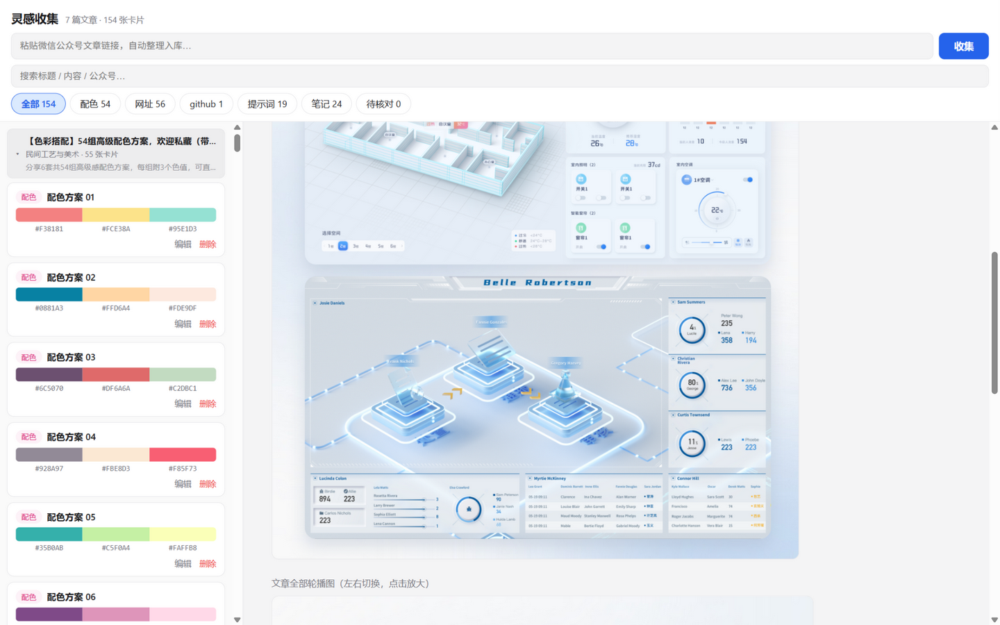

# 灵感收集 Inspiration Collector

把值得留存的微信公众号文章链接丢进来，自动抓取并用视觉大模型把内容**拆解成一张张"可复制的灵感卡片"**——配色（含色值）、网址、GitHub 项目、提示词、方法论笔记——形成可检索、可校验、可持续积累的本地灵感库。



## 为什么做这个

公众号好文（尤其设计/工具类）大多以图片形式排版，收藏等于进黑洞。灵感收集把"收藏"变成"拆解入库"：

- **配色方案** → 大色块 + `#十六进制`，点一下就复制，色值经原图像素采样校验；
- **便利网址 / GitHub 项目** → 整条复制或直接打开，自动探活标记失效链接；
- **提示词** → 全文逐字抄录，一键复制；
- **方法论** → AI 整理成带目录的笔记，可复制为 Markdown；
- 每张卡片保留**来源文章**和**图内定位裁剪图**（bbox），可对照原图核查修正。

## 功能特性

- **一键收集**：复制 `mp.weixin.qq.com/s/…` 链接即自动抓取入库（桌面版剪贴板监听 + 系统通知），也可在界面粘贴框手动提交；兼容传统图文与新版"图片消息"（轮播图）两种页面格式。
- **左列表 + 右详情**：列表按来源文章分组（父=文章及摘要，子=卡片），可折叠；详情页含定位裁剪图与全文轮播画廊，左右滑动查看原文所有插图。
- **单层分类**：全部 / 配色 / 网址 / github / 提示词 / 笔记 / 待核对，加全局搜索与栏宽拖拽。
- **校验闭环**：色值与原图像素比对（超阈值标"待核对"）、网址探活（404/域名不存在标"已失效"）、卡片可编辑删除。
- **本地优先**：SQLite + 原图全部存本机，不上传任何数据。

## 安装

从 [Releases](https://github.com/everalone/inspiration-collector/releases) 下载（Windows x64，未签名，SmartScreen 提示选"仍要运行"）：

- `InspirationCollector-Portable-x.x.x.exe`：**绿色单文件，双击即用**，无需安装；
- `InspirationCollector-Setup-x.x.x.exe`：安装版，带开始菜单/桌面快捷方式，可选安装目录。

两个版本数据互通（都存 `%AppData%\灵感收集\`）。

**首次使用**：启动后自动弹出设置（或点右上角 ⚙ 设置），填入 API Key 保存即可。默认用 DeepSeek（`deepseek-flash` 多模态，免费额度充足）；任何 OpenAI 兼容视觉模型均可，改 Base URL / Model 即可。配置保存在本机，不上传。

### 从源码运行

```bash
git clone https://github.com/everalone/inspiration-collector.git
cd inspiration-collector
npm install
npm run app     # 开发态桌面应用（key 在应用内 ⚙ 设置里填，或 cp .env.example .env）
npm run dist    # 打包 Setup + Portable（输出到 release/）
```

## 使用

- **收集**：复制文章链接 → 自动抓取、下载正文图、视觉模型拆卡、校验、入库，完成弹通知。手机上刷到的文章：复制链接发微信"文件传输助手"→ 电脑上复制即可。
- **卡片墙**：左侧列表点选卡片，右侧查看详情与来源原图；色块/网址/提示词点击即复制；笔记目录芯片跳转。
- **编辑**：每张卡可改标题/色值/网址/内容，可删除；"待核对"页签集中处理存疑项。
- **数据**：`%AppData%/灵感收集/` 下 `data/inspiration.db`（SQLite）与 `assets/`（正文原图），备份这两个目录即可迁移。

## 工作原理

```
链接 → 抓取(本机直连, data-src/cdn_url 双格式解析)
     → 视觉模型(严格 JSON schema 拆卡 + bbox 图内定位 + 防臆造规则)
     → 校验(色值像素采样 / 网址探活)
     → SQLite 入库
     → 卡片墙(本机 http 服务 + Electron 壳)
```

核心引擎（`core/`）与壳（`src-electron/`）解耦：打包态由 Electron 内置 Node 进程内运行（SQLite 用 Node 内置 `node:sqlite`，无原生编译依赖）；开发态也可 `npm run serve` 纯网页使用。

## 隐私

- 文章数据、原图、数据库全部存本地；
- 唯一外发请求是文章抓取（微信 CDN）与视觉模型 API 调用（发给你自己配置的模型服务商）；
- 仓库不含任何密钥，`.env` / `data/` / `assets/` 均已 gitignore。
